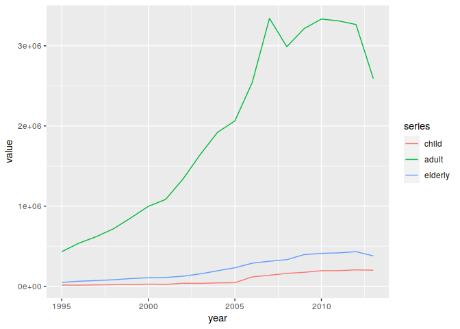
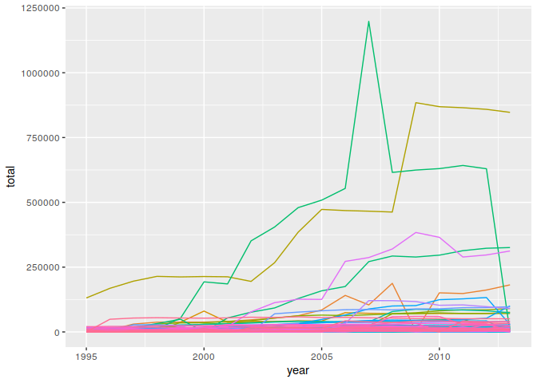

Wczytywanie danych (bibliotek)
------------------------------

    library(EDAWR)
    library(dplyr)
    library(ggplot2)
    require(reshape2)

Cache’owanie bloku wczytującego dane
------------------------------------

    df <- data.frame(tb)

Prezentacja krótkiego podsumowania danych w zbiorze
---------------------------------------------------

    knitr::kable(summary(df), na.rm=TRUE)

<table style="width:100%;">
<colgroup>
<col style="width: 3%" />
<col style="width: 17%" />
<col style="width: 13%" />
<col style="width: 17%" />
<col style="width: 16%" />
<col style="width: 15%" />
<col style="width: 17%" />
</colgroup>
<thead>
<tr class="header">
<th style="text-align: left;"></th>
<th style="text-align: left;">country</th>
<th style="text-align: left;">year</th>
<th style="text-align: left;">sex</th>
<th style="text-align: left;">child</th>
<th style="text-align: left;">adult</th>
<th style="text-align: left;">elderly</th>
</tr>
</thead>
<tbody>
<tr class="odd">
<td style="text-align: left;"></td>
<td style="text-align: left;">Length:3800</td>
<td style="text-align: left;">Min. :1995</td>
<td style="text-align: left;">Length:3800</td>
<td style="text-align: left;">Min. : 0.0</td>
<td style="text-align: left;">Min. : 0</td>
<td style="text-align: left;">Min. : 0.0</td>
</tr>
<tr class="even">
<td style="text-align: left;"></td>
<td style="text-align: left;">Class :character</td>
<td style="text-align: left;">1st Qu.:1999</td>
<td style="text-align: left;">Class :character</td>
<td style="text-align: left;">1st Qu.: 25.0</td>
<td style="text-align: left;">1st Qu.: 1128</td>
<td style="text-align: left;">1st Qu.: 84.5</td>
</tr>
<tr class="odd">
<td style="text-align: left;"></td>
<td style="text-align: left;">Mode :character</td>
<td style="text-align: left;">Median :2004</td>
<td style="text-align: left;">Mode :character</td>
<td style="text-align: left;">Median : 76.0</td>
<td style="text-align: left;">Median : 2589</td>
<td style="text-align: left;">Median : 230.0</td>
</tr>
<tr class="even">
<td style="text-align: left;"></td>
<td style="text-align: left;">NA</td>
<td style="text-align: left;">Mean :2004</td>
<td style="text-align: left;">NA</td>
<td style="text-align: left;">Mean : 493.2</td>
<td style="text-align: left;">Mean : 10864</td>
<td style="text-align: left;">Mean : 1253.0</td>
</tr>
<tr class="odd">
<td style="text-align: left;"></td>
<td style="text-align: left;">NA</td>
<td style="text-align: left;">3rd Qu.:2009</td>
<td style="text-align: left;">NA</td>
<td style="text-align: left;">3rd Qu.: 264.5</td>
<td style="text-align: left;">3rd Qu.: 6706</td>
<td style="text-align: left;">3rd Qu.: 640.0</td>
</tr>
<tr class="even">
<td style="text-align: left;"></td>
<td style="text-align: left;">NA</td>
<td style="text-align: left;">Max. :2013</td>
<td style="text-align: left;">NA</td>
<td style="text-align: left;">Max. :25661.0</td>
<td style="text-align: left;">Max. :731540</td>
<td style="text-align: left;">Max. :125991.0</td>
</tr>
<tr class="odd">
<td style="text-align: left;"></td>
<td style="text-align: left;">NA</td>
<td style="text-align: left;">NA</td>
<td style="text-align: left;">NA</td>
<td style="text-align: left;">NA’s :396</td>
<td style="text-align: left;">NA’s :413</td>
<td style="text-align: left;">NA’s :413</td>
</tr>
</tbody>
</table>

Prezentacja liczby zachorowań z podziałem na płeć
-------------------------------------------------

    df %>% 
      rowwise %>% 
      mutate(total=sum(child, adult, elderly, na.rm=TRUE)) %>% 
      group_by(sex) %>% 
      summarise(count=sum(total)) %>% 
      knitr::kable()

<table>
<thead>
<tr class="header">
<th style="text-align: left;">sex</th>
<th style="text-align: right;">count</th>
</tr>
</thead>
<tbody>
<tr class="odd">
<td style="text-align: left;">female</td>
<td style="text-align: right;">15656162</td>
</tr>
<tr class="even">
<td style="text-align: left;">male</td>
<td style="text-align: right;">27062807</td>
</tr>
</tbody>
</table>

5. Prezentacja na wykresie liniowym sumarycznej liczby zachorowań wśród dzieci, dorosłych i osób starszych w kolejnych latach
-----------------------------------------------------------------------------------------------------------------------------

    df %>% 
      rowwise %>% 
      mutate(total=sum(child, adult, elderly, na.rm=TRUE)) %>%
      group_by(year) %>%
      summarise(child=sum(child, na.rm=TRUE), adult=sum(adult, na.rm=TRUE), elderly=sum(elderly, na.rm=TRUE)) %>%
      melt(id.vars = 'year', variable.name = 'series') %>%
      ggplot(aes(year,value)) + geom_line(aes(colour = series))

6. Prezentacja sumarycznej liczby zachorowań osobno dla każdego kraju
---------------------------------------------------------------------

    df %>% 
      rowwise %>% 
      mutate(total=sum(child, adult, elderly, na.rm=TRUE)) %>%
      group_by(country, year) %>% 
      summarise(total=sum(child, na.rm=TRUE) + sum(adult, na.rm=TRUE) + sum(elderly, na.rm=TRUE)) %>%
      ggplot(aes(year,total,colour=country)) + geom_line(show.legend = FALSE)

