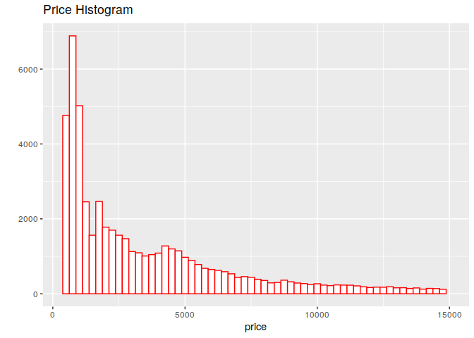
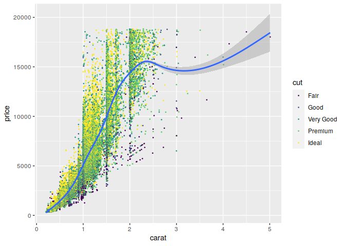

    library(dplyr)
    library(ggplot2)
    require(reshape2)

    df <- data.frame(diamonds)

Wyświetl histogram zmiennej depth
---------------------------------

    qplot(main="Depth Histogram", xlab="depth") + geom_histogram(mapping=aes(depth), data=df, fill=I("white"), col=I("red"))

Ustaw szerokość kubełka histogramu na 0.2
-----------------------------------------

    qplot(main="Depth Histogram", xlab="depth") + geom_histogram(mapping=aes(depth), data=df, fill=I("white"), col=I("red"), binwidth=0.2)

Ogranicz oś x do przedziału \[55, 70\]
--------------------------------------

    qplot(main="Depth Histogram", xlab="depth") + geom_histogram(mapping=aes(depth), data=df, fill=I("white"), col=I("red"), binwidth=0.2) + xlim(55,70)

Sprawdź jak zmienna cut wpływa na histogram:
--------------------------------------------

### za pomocą koloru

    qplot(main="Depth Histogram grouped by cut", xlab="depth") + geom_histogram(mapping=aes(depth, color=cut), data=df, binwidth=0.2) + xlim(55,70)

### za pomocą paneli

    qplot(main="Depth Histogram grouped by cut", xlab="depth") + facet_wrap(~cut) + geom_histogram(mapping=aes(depth), data=df, fill=I("white"), col=I("red"), binwidth=0.2) + xlim(55,70)

Powtórz kroki dla zmiennej price (być może zmieniając wartości części parametrów)
---------------------------------------------------------------------------------

### Wyświetl histogram zmiennej price

    qplot(main="Price Histogram", xlab="price") + geom_histogram(mapping=aes(price), data=df, fill=I("white"), col=I("red"))

### Ustaw szerokość kubełka histogramu

    qplot(main="Price Histogram", xlab="price") + geom_histogram(mapping=aes(price), data=df, fill=I("white"), col=I("red"), binwidth=250)

### Ogranicz oś x

    qplot(main="Price Histogram", xlab="price") + geom_histogram(mapping=aes(price), data=df, fill=I("white"), col=I("red"), binwidth=250) + xlim(350,15000)

### Sprawdź jak zmienna cut wpływa na histogram:

### za pomocą koloru

    qplot(main="Price Histogram grouped by cut", xlab="price") + geom_histogram(mapping=aes(price, color=cut), data=df, binwidth=250) + xlim(350,15000)

### za pomocą paneli

    qplot(main="Price Histogram grouped by cut", xlab="price") + facet_wrap(~cut) + geom_histogram(mapping=aes(price), data=df, fill=I("white"), col=I("red"), binwidth=250) + xlim(350,15000)

Zwizualizuj relację między zmiennymi carat i price
--------------------------------------------------

    qplot(ylab="price", xlab="carat") + geom_point(data=df, mapping=aes(y=price, x=carat), size=.3)

