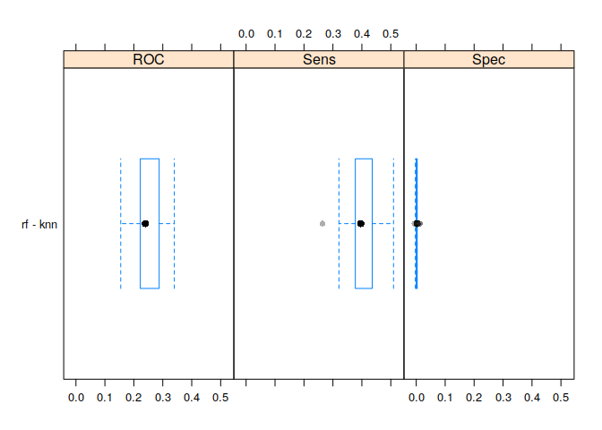
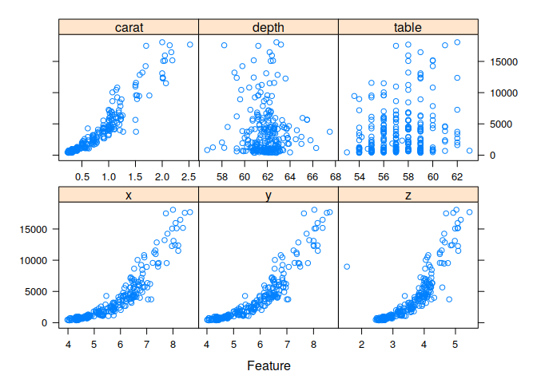

Załaduj zbiór danych churn:
---------------------------

    library(modeldata)
    library(dplyr)

    ## 
    ## Attaching package: 'dplyr'

    ## The following objects are masked from 'package:stats':
    ## 
    ##     filter, lag

    ## The following objects are masked from 'package:base':
    ## 
    ##     intersect, setdiff, setequal, union

    data(mlc_churn)
    churnData <- data.frame(mlc_churn)

    library(caret)
    set.seed(42)

Podziel ten zbiór na uczący i testowy (75% w zbiorze uczącym)
-------------------------------------------------------------

    inTraining <-
        createDataPartition(
            y = churnData$churn,
            p = .75,
            list = FALSE)

    training <- churnData[ inTraining,]
    testing  <- churnData[-inTraining,]

Przetestuj dwa algorytmy klasyfikacyjne
---------------------------------------

    ctrl <- trainControl(method = "none")
    fit <- train(churn ~ ., data = training, method = "rf", trControl = ctrl, preProc = c("center", "scale"), ntree = 10)
    fit

    ## Random Forest 
    ## 
    ## 3751 samples
    ##   19 predictor
    ##    2 classes: 'yes', 'no' 
    ## 
    ## Pre-processing: centered (69), scaled (69) 
    ## Resampling: None

    confusionMatrix(data = predict(fit, newdata = testing), testing$churn)

    ## Confusion Matrix and Statistics
    ## 
    ##           Reference
    ## Prediction  yes   no
    ##        yes  139   22
    ##        no    37 1051
    ##                                           
    ##                Accuracy : 0.9528          
    ##                  95% CI : (0.9395, 0.9638)
    ##     No Information Rate : 0.8591          
    ##     P-Value [Acc > NIR] : < 2e-16         
    ##                                           
    ##                   Kappa : 0.7977          
    ##                                           
    ##  Mcnemar's Test P-Value : 0.06836         
    ##                                           
    ##             Sensitivity : 0.7898          
    ##             Specificity : 0.9795          
    ##          Pos Pred Value : 0.8634          
    ##          Neg Pred Value : 0.9660          
    ##              Prevalence : 0.1409          
    ##          Detection Rate : 0.1113          
    ##    Detection Prevalence : 0.1289          
    ##       Balanced Accuracy : 0.8846          
    ##                                           
    ##        'Positive' Class : yes             
    ## 

    fit2 <- train(churn ~ ., data = training, method = "knn", trControl = ctrl)
    fit2

    ## k-Nearest Neighbors 
    ## 
    ## 3751 samples
    ##   19 predictor
    ##    2 classes: 'yes', 'no' 
    ## 
    ## No pre-processing
    ## Resampling: None

    confusionMatrix(data = predict(fit2, newdata = testing), testing$churn)

    ## Confusion Matrix and Statistics
    ## 
    ##           Reference
    ## Prediction  yes   no
    ##        yes   50   16
    ##        no   126 1057
    ##                                           
    ##                Accuracy : 0.8863          
    ##                  95% CI : (0.8674, 0.9034)
    ##     No Information Rate : 0.8591          
    ##     P-Value [Acc > NIR] : 0.002609        
    ##                                           
    ##                   Kappa : 0.3644          
    ##                                           
    ##  Mcnemar's Test P-Value : < 2.2e-16       
    ##                                           
    ##             Sensitivity : 0.28409         
    ##             Specificity : 0.98509         
    ##          Pos Pred Value : 0.75758         
    ##          Neg Pred Value : 0.89349         
    ##              Prevalence : 0.14091         
    ##          Detection Rate : 0.04003         
    ##    Detection Prevalence : 0.05284         
    ##       Balanced Accuracy : 0.63459         
    ##                                           
    ##        'Positive' Class : yes             
    ## 

Zastanów się czy warto wstępnie przetworzyć zbiór
-------------------------------------------------

Wstępne przetwarzanie zbioru nie zawsze jest dobrym rozwiązaniem, może
to naruszyć strukturę danych. Jednakże przetwarzanie danych wskazane
jest np. przy kNN czy sieciach neuronowych.

Określ przestrzeń przeszukiwania parametrów
-------------------------------------------

    gridCtrl <- trainControl(
        method = "cv",
        summaryFunction = twoClassSummary,
        classProbs = TRUE)

    rfGrid1 <- expand.grid(mtry = 1:5)
    fitTune <- train(churn ~ .,
                 data = training,
                 method = "rf",
                 metric = "ROC",
                 trControl = gridCtrl,
                 tuneGrid = rfGrid1)

    rfGrid2 <- expand.grid(k = c(1,2,3,4,5))
    fitTune2 <- train(churn ~ .,
                 data = training,
                 method = "knn",
                 metric = "ROC",
                 preProc = c("center", "scale"),
                 trControl = gridCtrl,
                 tuneGrid = rfGrid2)

Porównaj algorytmy za pomocą wykresu
------------------------------------

    resamps <- resamples(list(rf = fitTune, knn = fitTune2))
    difValues <- diff(resamps)

    theme1 <- trellis.par.get()
    theme1$plot.symbol$col = rgb(.2, .2, .2, .4)
    theme1$plot.symbol$pch = 16
    theme1$plot.line$col = rgb(1, 0, 0, .7)
    theme1$plot.line$lwd <- 2

    trellis.par.set(theme1)
    bwplot(difValues, layout = c(3, 1))

Załaduj zbiór diamonds:
-----------------------

    library(ggplot2)

    data <- data.frame(diamonds)

Podziel zbiór na uczący i testowy w proporcjach 70%-30%
-------------------------------------------------------

    inTraining <-
        createDataPartition(
            y = data$price,
            p = .70,
            list = FALSE)

    training <- data[ inTraining,]
    testing  <- data[-inTraining,]

Stwórz model regresyjny, który przewidzi cenę diamentu na podstawie wartości pozostałych parametrów
---------------------------------------------------------------------------------------------------

    ctrl <- trainControl(method = "none")
    model <- train(price ~ ., data = training, method = "lm", trControl = ctrl)

    predicted = predict(model, newdata=select(testing, -c(price)))
    gt = testing$price
    MAE(predicted, gt)

    ## [1] 746.9834

W trakcie pracy przypatrz się wpływowi różnych zmiennych na cenę diamentu
-------------------------------------------------------------------------

    library(dplyr)
    data <- sample_n(diamonds, 250)
    featurePlot(x = data[,c("x","y","z","carat","depth","table")],
                y = data$price, 
                plot = "scatter",
                auto.key = list(columns = 3))

