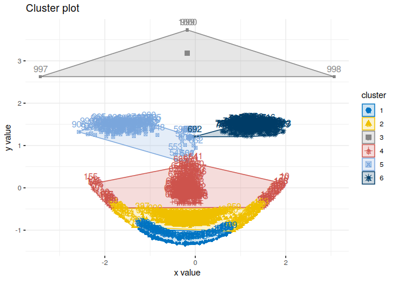
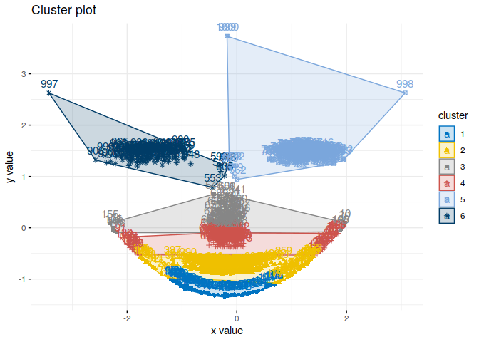
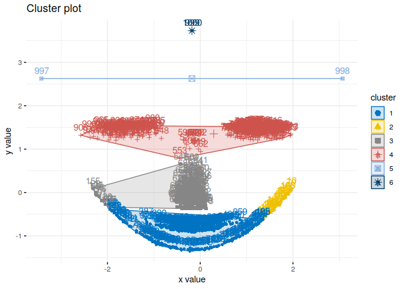
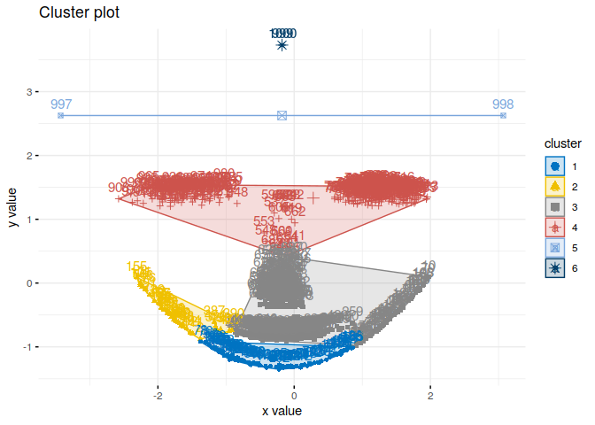
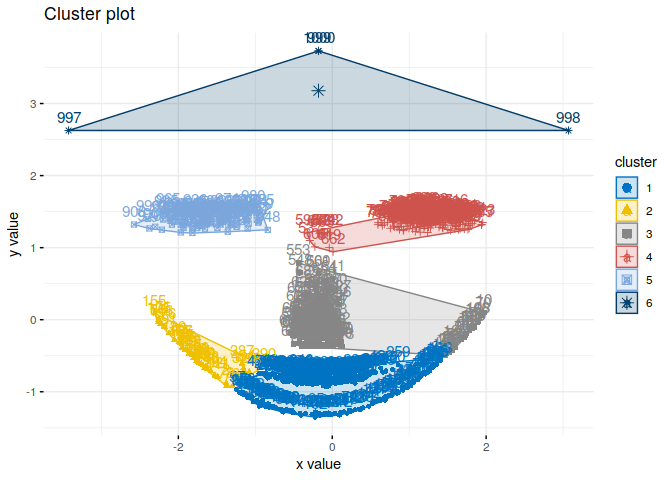

    library(fpc)
    library(NbClust)
    library(dplyr)
    library(aricode)
    library(factoextra)

Stwórz zbiór danych w następujący sposób:
-----------------------------------------

    set.seed(23)
    face <- rFace(1000, p=2, dMoNo=3)
    df = data.frame(x=face[,1], y=face[,2])
    labels = as.integer(attr(face,"grouping"))

Przetestuj różne algorytmy grupowania
-------------------------------------

### K-means

    km.res <- eclust(df, "kmeans", k = 6, nstart = 25, graph = F)
    fviz_cluster(km.res, palette = "jco", ggtheme = theme_minimal())

    ARI(km.res$cluster, labels)

    ## [1] 0.7549897

    table(labels, km.res$cluster)

    ##       
    ## labels   1   2   3   4   5   6
    ##      1  93  60   0  46   0   0
    ##      2   0   0   0   0 100   0
    ##      3   0 299   0   0   0   0
    ##      4   0   0   0 184  14   1
    ##      5   0   0   0   0   0 199
    ##      6   0   0   4   0   0   0

### K-medioids

    pam.res <- eclust(df, "pam", k = 6, graph = F)
    fviz_cluster(pam.res, palette = "jco", ggtheme = theme_minimal())

    ARI(pam.res$cluster, labels)

    ## [1] 0.708845

    table(labels, pam.res$cluster)

    ##       
    ## labels   1   2   3   4   5   6
    ##      1  88  61  12  38   0   0
    ##      2   0   0   0   0   0 100
    ##      3   0 299   0   0   0   0
    ##      4   0   0  70 117   7   5
    ##      5   0   0   0   0 199   0
    ##      6   0   0   0   0   3   1

### AHC

    ahc.res <- eclust(df, "hclust", k = 6, hc_metric = "manhattan", hc_method = "complete", graph = F)
    fviz_cluster(ahc.res, palette = "jco", ggtheme = theme_minimal())

    ARI(ahc.res$cluster, labels)

    ## [1] 0.6026423

    table(labels, ahc.res$cluster)

    ##       
    ## labels   1   2   3   4   5   6
    ##      1 156  31  12   0   0   0
    ##      2   0   0   0 100   0   0
    ##      3 299   0   0   0   0   0
    ##      4   0   0 187  12   0   0
    ##      5   0   0   0 199   0   0
    ##      6   0   0   0   0   2   2

### Diana

    diana.res <- eclust(df, "diana", k = 6, hc_metric = "manhattan")
    fviz_cluster(diana.res, palette = "jco", ggtheme = theme_minimal())

    ARI(diana.res$cluster, labels)

    ## [1] 0.4292179

    table(labels, diana.res$cluster)

    ##       
    ## labels   1   2   3   4   5   6
    ##      1 100  35  64   0   0   0
    ##      2   0   0   0 100   0   0
    ##      3   0   7 292   0   0   0
    ##      4   0   0 179  20   0   0
    ##      5   0   0   0 199   0   0
    ##      6   0   0   0   0   2   2

### Agnes

    agnes.res <- eclust(df, "agnes", k = 6, hc_metric = "manhattan")
    fviz_cluster(agnes.res, palette = "jco", ggtheme = theme_minimal())

    ARI(agnes.res$cluster, labels)

    ## [1] 0.6809605

    table(labels, agnes.res$cluster)

    ##       
    ## labels   1   2   3   4   5   6
    ##      1 134  37  28   0   0   0
    ##      2   0   0   0   0 100   0
    ##      3 294   5   0   0   0   0
    ##      4   0   0 188  11   0   0
    ##      5   0   0   0 199   0   0
    ##      6   0   0   0   0   0   4
